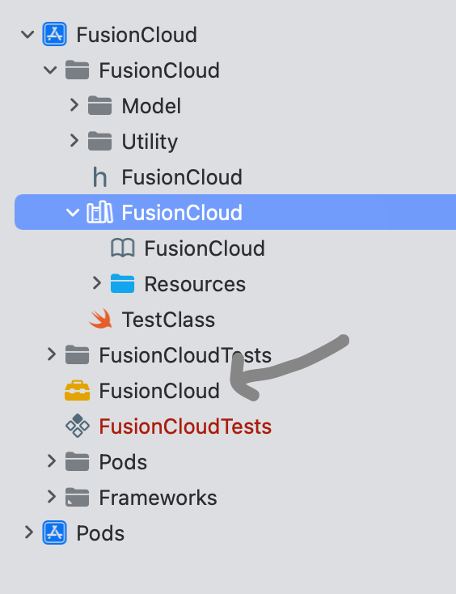
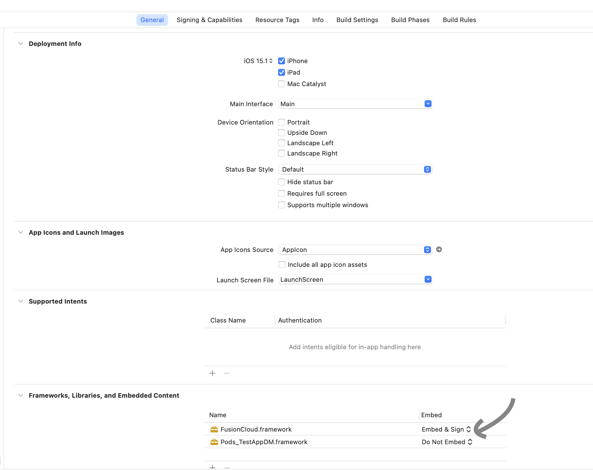

#  ``fusionCloud-framework-ios``

## Overview
This repository contains a websocket client and security components to make it easy for developer to connect and communicate with the DataMesh Unify payments platform.

## Getting started

### Dependencies

The following toolset is required:

* Xcode ~13.4
* CocoaPods ~1.11
* iOS 12

Frameworks are managed by CocoaPods

* [ObjectMapper](https://cocoapods.org/pods/ObjectMapper)- pod dependency that convert JSON into Swift model
* [IDZSwiftCommonCrypto](https://github.com/iosdevzone/IDZSwiftCommonCrypto)- pod dependency that help encryption/decryption

### Building the FusionCloud framework

*To ensure your environment is configured for iOS development, follow the instructions in Appendix A*

Clone the FusionCloud framework
* `git clone https://github.com/datameshgroup/fusioncloud-sdk-ios.git`

Install CocoaPods managed frameworks:

* Navigate to the project directory
* Run `pod install` to install, and `pod update` to update 
* If you need to reinstall, run `pod cache clean --all` then `pod install` again

Set your build target:
* Select build destination from Product/Destination menu
* Supported destinations are iOS Simulator, or iOS Device arm64 

Build the library 
* Press ⌘+B, or ⌘+K+B to rebuild
* Once build is successful, control+click the *FusionCloud* toolkit icon, and select *Show in Finder* 

* Copy `FusionCloud.framework` into your POS project directory 
* In your POS project, select Workspace, then General and select the library under (Frameworks, Libraries, and Embedded content section) 

* Click the add button and select `FusionCloud.framework` 
* During development it can be quicker to use the command line `cp -R source destination` to copy the updated `FusionCloud.framework`  into your project directory. 

### Using FusionCloud framework 

See the [DataMesh Fusion API](https://datameshgroup.github.io/fusion) documentation for a full description of schema and workflows. 

The [fusioncloud-sdk-ios-demo](https://github.com/datameshgroup/fusioncloud-sdk-ios-demo) application provides sample code for using the FusionCloud.framework library. 

Construct an instance of `FusionCloudConfig` using the configuration provided by DataMesh. See the [Fusion API](https://datameshgroup.github.io/fusion/#getting-started-design-your-integration-sale-system-settings) for instructions on how to manage settings. 

```
fusionCloudConfig = FusionCloudConfig()
fusionCloudConfig!.initConfig(
testEnvironment: true | false,
providerIdentification: "<<Provided by DataMesh>>",
applicationName: "<<Provided by DataMesh>>",
softwareVersion: "<<Your POS version>>",
certificationCode: "<<Provided by DataMesh>>",
saleID: "<<Provided by DataMesh>>",
poiID: "<<Provided by DataMesh>>",
kekValue: "<<Provided by DataMesh>>")
```

Build and send a login 

```
let loginRequest = LoginRequest()
loginRequest.dateTime = Date()
loginRequest.operatorID = "sfsuper"
loginRequest.operatorLanguage = "en"
let saleSoftware = SaleSoftware()
saleSoftware.providerIdentification = fusionCloudConfig!.providerIdentification
saleSoftware.ApplicationName = fusionCloudConfig!.applicationName
saleSoftware.softwareVersion = fusionCloudConfig!.softwareVersion
saleSoftware.certificationCode = fusionCloudConfig!.certificationCode
let saleTerminalData = SaleTerminalData()
saleTerminalData.terminalEnvironment = "Attended"
saleTerminalData.saleCapabilities = ["CashierStatus","CashierError","CashierInput","CustomerAssistance","PrinterReceipt"]

loginRequest.saleTerminalData = saleTerminalData
loginRequest.saleSoftware = saleSoftware
```

Build and send a Payment

```
let paymentRequest = PaymentRequest()
let saleData = SaleData()
saleData.tokenRequestedType = "Customer"
saleData.saleTransactionID = SaleTransactionID(transactionID: "3000403")

let paymentTransaction = PaymentTransaction()

let amountsReq = AmountsReq(
amountsReq.currency = "AUD"
amountsReq.requestedAmount = requestedAmount
amountsReq.tipAmount = tipAmount

let saleItem1 = SaleItem()
saleItem1.itemID = 1
saleItem1.productCode = "SKU00FFDDG"
saleItem1.unitMeasure = "Unit"
saleItem1.quantity = 1
saleItem1.unitPrice = 42.50
saleItem1.productLabel = "NVIDIA GEFORCE RTX 3090"

paymentTransaction.amountsReq = amountsReq
paymentTransaction.saleItem = [saleItem1]

let paymentData = PaymentData(paymentType: paymentType) // paymentType = Normal|Refund
paymentRequest.saleData = saleData
paymentRequest.paymentTransaction = paymentTransaction
paymentRequest.paymentData = paymentData
```


## Appendix A - environment configuration

Skip this section if your Mac environment is configured for iOS development.

### Xcode

* Xcode can be installed from the [App Store](https://developer.apple.com/xcode/)
* Ensure latest Mac updates are installed

### Ruby

Ruby ~3.1.2 is required to install cocoapods. A full guide for installing Ruby can be found [here](https://www.moncefbelyamani.com/how-to-install-xcode-homebrew-git-rvm-ruby-on-mac/)

* Run `brew doctor`. If you don't see "your system is ready to brew", follow the instructions to install [homebrew](https://brew.sh)
* Make sure you follow all extra commands the homebrew install asks you to run
* Run `brew install chruby ruby-install` to install chruby
* Run `ruby-install ruby` to install the latest Ruby
* Configure shell and restart
```
echo "source $(brew --prefix)/opt/chruby/share/chruby/chruby.sh" >> ~/.zshrc
echo "source $(brew --prefix)/opt/chruby/share/chruby/auto.sh" >> ~/.zshrc
echo "chruby ruby-3.1.2" >> ~/.zshrc
```
* Run `ruby -v` to check the Ruby version. It should be 3.1.2

### CocoaPods

* Run `pod --version` to check the current CocoaPods version
* Run `gem install cocoapods` to update to the latest CocoaPods

